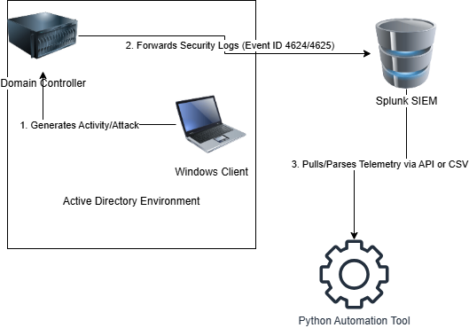
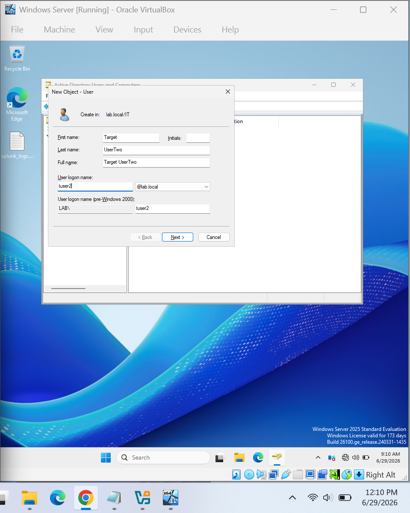
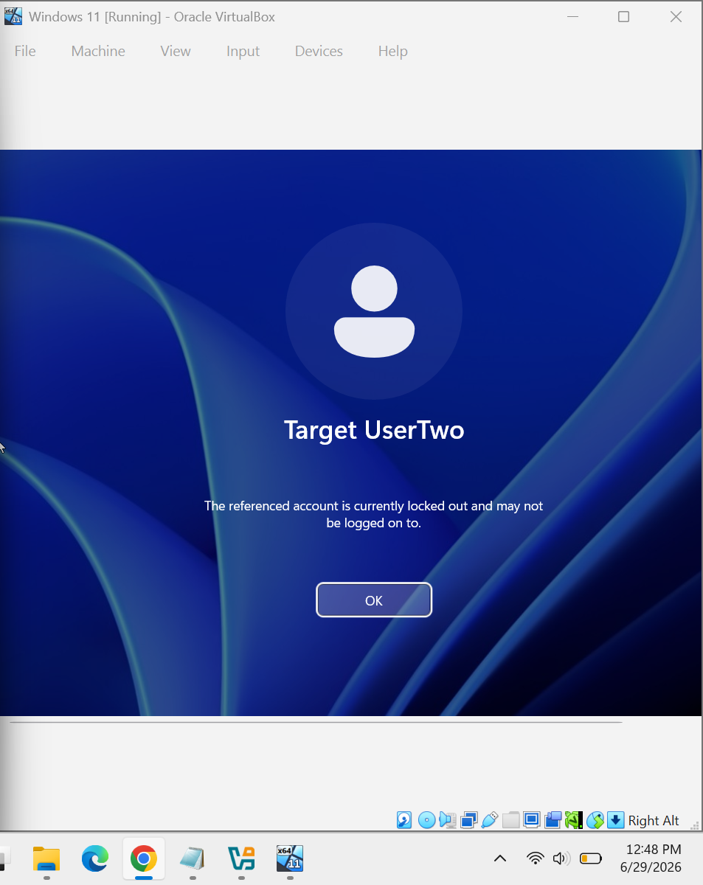
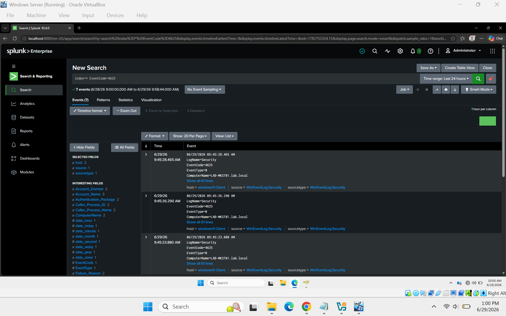
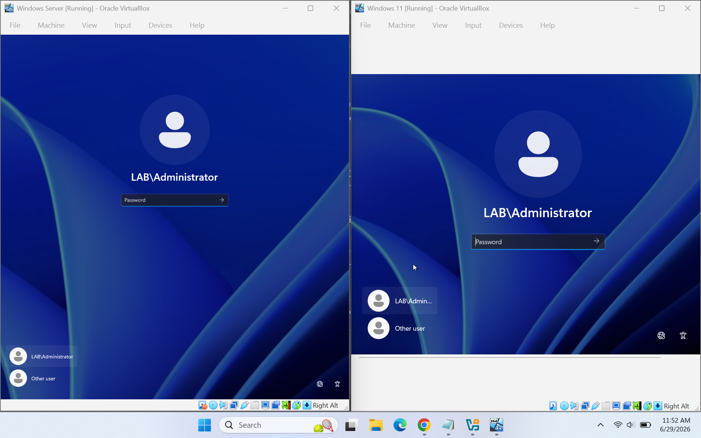

# Mini-SOC Capstone Project: Automated Brute-Force Detection Pipeline

##  Project Overview
This capstone project showcases the design and implementation of a centralized, automated Security Operations Center (SOC) home lab environment. The pipeline simulates a multi-stage brute-force/password spraying attack against an Active Directory Domain Controller, ingests the resulting telemetry into a Splunk SIEM instance, and utilizes a custom Python automation tool to programmatically parse the log files and generate actionable security visibility metrics.

##  Technologies & Tools Used
*   **Hypervisor:** Oracle VirtualBox
*   **Operating Systems:** Windows Server 2025 (Domain Controller), Windows 11 Enterprise (Client Workstation)
*   **Identity Management:** Active Directory (AD DS)
*   **SIEM Platform:** Splunk Enterprise
*   **Automation Language:** Python 3 (Log Parser Script)
*   **Command Line Tooling:** PowerShell

---

##  Architecture Diagram
Below is the technical data flow of the Mini-SOC pipeline:

1.  **Attack Generation:** Malicious login activity is introduced at the Windows Client VM.
2.  **Telemetry Ingestion:** The Windows Domain Controller generates authentication event logs and forwards them directly to the centralized SIEM platform.
3.  **Automated Processing:** A custom Python security tool pulls the telemetry dataset, extracts event values, isolates anomalies, and prints a parsed triage report.

---

##  Execution & Detection Phases

### Phase 1: Environment Baseline & Identity Provisioning
To establish a test baseline, a dedicated domain user account named `Target UserTwo` (`tuser2@lab.local`) was provisioned inside the isolated `lab.local/IT` Organizational Unit (OU) on the Windows Server Domain Controller.

### Phase 2: Endpoint Deployment
The target Windows 11 client environment was booted and validated to ensure domain workstation stability and active logging readiness across the internal virtual network.

### Phase 3: Attack Execution & Account Lockout
A credential attack scenario was simulated against the domain user account. The high volume of consecutive incorrect authentication requests successfully tripped the Domain Controller's safety threshold, resulting in an explicit Account Lockout on the client workstation.

### Phase 4: SIEM Event Querying
The generated telemetry was successfully collected by Splunk Enterprise. Querying the SIEM utilizing `index=* EventCode=4625` confirmed the precise indexing of the failed authentication attempts originates from the client machine name (`LAB-WKSTN01.lab.local`).

### Phase 5: Automated Log Triage
The telemetry data file (`capstone_logs.txt`) was passed from the isolated lab onto the host machine via a secure Shared Folder directory. The custom Python automation script parsed the raw unstructured log formatting, filtering out system noise while clearly flagging the brute-force footprint and target identity.

---

##  Lessons Learned & Engineering Improvements

### 1. File System and String Handling Nuances
*   **The Issue:** Default Windows system settings initially masked known extensions, resulting in hidden duplicate formats (e.g., `capstone_logs.txt`). Concurrently, raw log entries passed empty fields as structural string literals (`-`), creating artifact user profiles in parsing arrays.
*   **The Resolution:** Developed a pipeline sanitization process using PowerShell's object pipeline to clean file names. Optimized the Python script logic to explicitly validate username lengths and screen out automated system system headers.

### 2. File Transfers vs. Live Integrations
*   **The Issue:** Operating inside highly structured, isolated virtual subnets meant the host scripting environment had to process static exported telemetry data chunks rather than fetching queries natively.
*   **Future Optimization:** For production scalability, I will reconfigure the virtual network interface to a Host-Only adapter layout. This allows the Python script to utilize the `splunklib` library to query the live Splunk REST API over HTTP/HTTPS, enabling near-real-time threat detection alerting.
